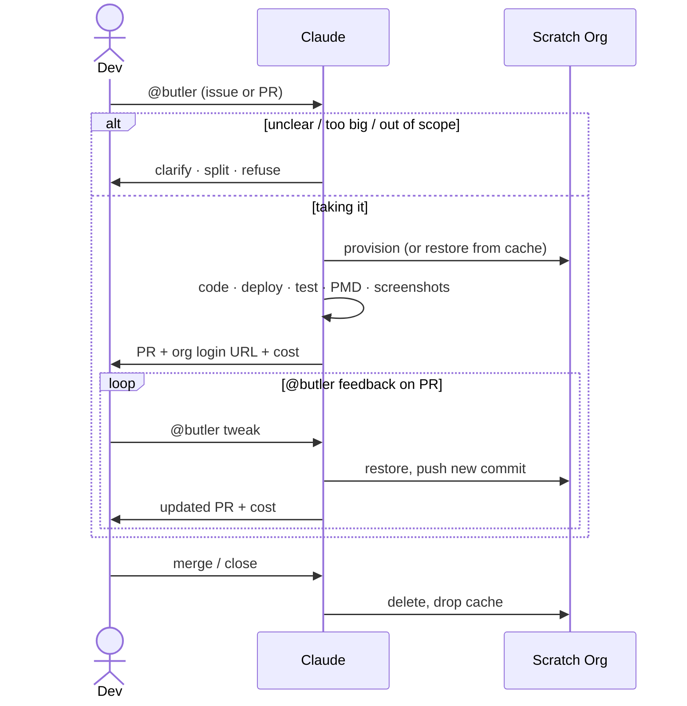

# salesforce-ai-tools

Reusable GitHub Actions workflows and Claude Code skills for AI-assisted Salesforce development. Drop these into any Salesforce repo to get an AI agent that triages issues, opens pull requests, verifies UI changes, and more — all triggered by a simple `@butler` mention.

## Contents

- [What's here](#whats-here)
- [How it works](#how-it-works)
- [Features](#features)
- [Using in your repo](#using-in-your-repo)
- [Skills locally](#skills-locally)

---

## What's here

**Skills** ([.claude/skills/](.claude/skills/)) — Specialized behaviors Claude Code loads at runtime.

| Skill | What it does |
|---|---|
| [sf-ticket-to-pr](.claude/skills/sf-ticket-to-pr/SKILL.md) | Reads a GitHub issue or PR thread and acts on it — writes code, opens a PR, asks for clarification, or refuses |
| [agentforce](.claude/skills/agentforce/SKILL.md) | Tests and deploys Agentforce agents and prompt templates |
| [agentforce-deploy](.claude/skills/agentforce-deploy/SKILL.md) | Handles the manual fixups Salesforce CLI doesn't cover when deploying Agentforce metadata |
| [playwright-sf](.claude/skills/playwright-sf/SKILL.md) | Drives a Salesforce Lightning org headlessly to reproduce bugs and verify UI changes |
| [sf-code-analyzer](.claude/skills/sf-code-analyzer/SKILL.md) | Runs Salesforce Code Analyzer on changed Apex, Flow, or metadata files |

**Workflows** ([.github/workflows/](.github/workflows/)) — Reusable via the `uses:` keyword in any repo's workflow file.

| Workflow | What it does |
|---|---|
| [sf-ticket-to-pr.yml](.github/workflows/sf-ticket-to-pr.yml) | Mention-driven pipeline: fires on `@butler` mentions, triages, then executes |
| [sf-pr-cleanup.yml](.github/workflows/sf-pr-cleanup.yml) | Deletes the per-PR scratch org when a PR closes |

**Scripts** ([scripts/](scripts/)) — Shell utilities used by the workflows.

| Script | What it does |
|---|---|
| [create-scratch-org.sh](scripts/create-scratch-org.sh) | Provisions or restores a scratch org from cache |
| [report-ai-cost.sh](scripts/report-ai-cost.sh) | Appends cost/token footers to PRs and rolls up totals on the originating issue |

---

## How it works



`@butler` works in issue bodies, issue comments, PR reviews, and PR review replies.

### Triage

The first job runs only Claude — no Salesforce CLI, no scratch org. A clarification or refusal costs cents, not a provisioning cycle. Claude reads the full thread and picks one outcome:

- **Take it** — posts a plan, ends the comment with a hidden `<!-- butler:proceed -->` marker. The execute job greps for it.
- **Clarify** — asks one or two specific questions. Stops.
- **Split** — proposes sub-stories. Stops. A human opens them and mentions butler on each.
- **Refuse** — one sentence, no marker. Stops.

### Execute

The scratch org is provisioned once on the first run for an issue. Its SFDX auth URL is cached under `scratch-auth-pr-<issue-number>` — keyed on the issue, not the PR, so the same org is reused across the issue run and every PR follow-up. [create-scratch-org.sh](scripts/create-scratch-org.sh) detects the cached file on subsequent runs, re-logs in, validates the org, and exits without reprovisioning. If the org has expired or the cache was evicted, the script falls through to a full provision. A `concurrency:` group keyed on the issue number serializes concurrent runs against the same org.

Claude runs in `bypassPermissions` mode — the `author_association` gate on the workflow handles access control. It has access to the Playwright MCP server via [.claude/mcp.json](.claude/mcp.json) for UI verification of user-visible changes.

### Cost reporting

[report-ai-cost.sh](scripts/report-ai-cost.sh) extracts cost and tokens from the SDK execution file, appends a footer to the PR or comment, and updates a sticky rollup on the originating issue. Each run is stored as a hidden HTML marker so totals survive comment edits. Both triage and execute call this script.

### Cleanup

[sf-pr-cleanup.yml](.github/workflows/sf-pr-cleanup.yml) fires on PR close and deletes the scratch org and cache entry. Best-effort — if either is already gone it logs a notice and continues.

---

## Features

| | |
|---|---|
| 💬 **No state machine** | Every fire reads the full thread fresh. No labels carry state between runs. If butler refused last time, mention it again with more context. |
| 🛑 **Triage before infra** | The triage job runs only Claude — no scratch org, no SF CLI. Clarification, split, and refusal outcomes cost cents each, not a provisioning cycle. |
| 🏷️ **Persistent scratch org** | The org is provisioned once and cached for the entire PR lifetime. Follow-up runs restore it in seconds. |
| 🔗 **Self-evidencing PRs** | Every PR body and reviewer reply includes a clickable auto-login URL to the scratch org plus inline Playwright screenshots for UI changes. |
| 💰 **Cost transparency** | Both triage and execute report cost. The originating issue carries a sticky rollup, one row per `@butler` cycle. |
| 🤖 **No GitHub App needed** | Commits and PRs go out as `github-actions[bot]` via the built-in `GITHUB_TOKEN`. Bot-authored events don't retrigger the workflow, so the agent can't summon itself. |
| ♻️ **One script for dev and CI** | [create-scratch-org.sh](scripts/create-scratch-org.sh) is what developers run locally too — CI just sets `HEADLESS=true`. |

---

## Using in your repo

Prereqs: GitHub org admin, Salesforce DevHub, Anthropic API key.

**Step 1 — Reference the reusable workflows**

Create `.github/workflows/sf-ticket-to-pr.yml` in your repo:

```yaml
name: SF Ticket to PR

on:
  issues:
    types: [opened, edited]
  issue_comment:
    types: [created]
  pull_request_review:
    types: [submitted]
  pull_request_review_comment:
    types: [created]

jobs:
  pipeline:
    uses: aquivalabs/salesforce-ai-tools/.github/workflows/sf-ticket-to-pr.yml@main
    secrets: inherit
```

Create `.github/workflows/sf-pr-cleanup.yml`:

```yaml
name: SF PR Cleanup

on:
  pull_request:
    types: [closed]

jobs:
  cleanup:
    uses: aquivalabs/salesforce-ai-tools/.github/workflows/sf-pr-cleanup.yml@main
    secrets: inherit
```

The `on:` block stays in your repo. The `uses:` line delegates all logic here — this repo checks itself out at runtime so Claude has access to all skills automatically.

**Step 2 — Set repo secrets** (Settings → Secrets and variables → Actions)

| Secret | Value |
|---|---|
| `SFDX_AUTH_URL` | `sf org display --verbose --target-org <devhub> --json \| jq -r '.result.sfdxAuthUrl'` |
| `ANTHROPIC_API_KEY` | Your Anthropic API key. Or use `CLAUDE_CODE_OAUTH_TOKEN` to bill a Max subscription instead (`claude setup-token`). |

The built-in `GITHUB_TOKEN` covers everything else — no PAT or GitHub App needed.

**Step 3 — Create the label**

```bash
gh label create ai-involved --description "Butler (AI) was involved in this issue or PR" --color FBCA04
```

**Step 4 — Trigger it**

Mention `@butler` in any issue or pull request comment:

```
@butler please add a validation rule to Account that requires Phone when BillingCountry is "US"
```

Non-Salesforce repo? Replace the deploy/test commands in [.claude/skills/sf-ticket-to-pr/SKILL.md](.claude/skills/sf-ticket-to-pr/SKILL.md) with your toolchain's equivalents. Want a different trigger word? Search-and-replace `@butler` in [sf-ticket-to-pr.yml](.github/workflows/sf-ticket-to-pr.yml) and [SKILL.md](.claude/skills/sf-ticket-to-pr/SKILL.md).

---

## Skills locally

Clone this repo once and run [scripts/install-sf-ai-tools.sh](scripts/install-sf-ai-tools.sh). It symlinks skills, rules, settings, and the MCP config into `~/.claude/` so they're available in every project on your machine — no per-project copying needed.

```bash
git clone https://github.com/aquivalabs/salesforce-ai-tools ~/salesforce-ai-tools
~/salesforce-ai-tools/scripts/install-sf-ai-tools.sh
```

Then invoke any skill with a slash command in Claude Code:

```
/sf-code-analyzer
/agentforce-deploy
```

Pulling the latest version of this repo is all you need to update — the symlinks always point to the current files.
