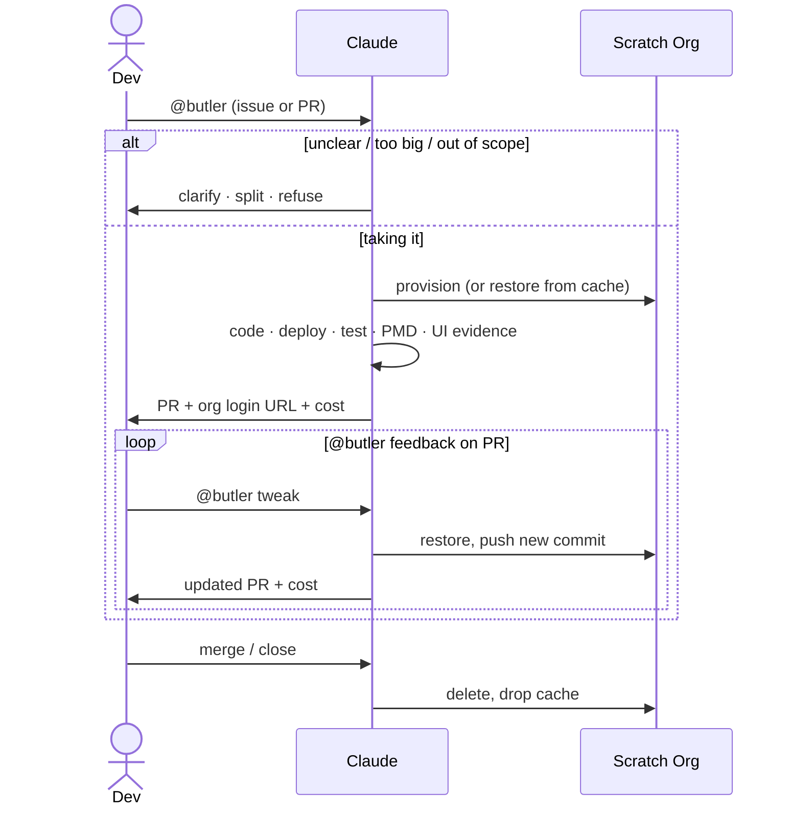

# salesforce-ai-tools

Reusable GitHub Actions workflows and Claude Code skills for AI-assisted Salesforce development. Drop these into any Salesforce repo to get an AI agent that triages issues, opens pull requests, verifies UI changes, and more — all triggered by a simple `@butler` mention.

## Contents

- [1. Skills](#1-skills)
  - [1.1 Install locally](#11-install-locally)
- [2. GitHub pipelines](#2-github-pipelines)
  - [2.1 Workflows and scripts](#21-workflows-and-scripts)
  - [2.2 How the pipeline works](#22-how-the-pipeline-works)
  - [2.3 Metadata failure memory](#23-metadata-failure-memory)
  - [2.4 Cost reporting](#24-cost-reporting)
  - [2.5 What you get on the PR](#25-what-you-get-on-the-pr)
  - [2.6 Features](#26-features)
  - [2.7 Using in your repo](#27-using-in-your-repo)

---

## 1. Skills

Specialized behaviors Claude Code loads at runtime. In CI the reusable workflow checks out this repo automatically — no setup needed. For local use, see [1.1 Install locally](#11-install-locally) below.

| Skill | What it does | Contributed by |
| ----- | ------------ | -------------- |
| **[sf-ticket-to-pr](.claude/skills/sf-ticket-to-pr/SKILL.md)** | The core pipeline skill. Reads a GitHub issue or PR thread, decides whether to take it, clarify, split into sub-stories, or refuse — then codes, deploys to a scratch org, runs tests and PMD, captures Playwright UI evidence, opens a PR, and posts an auto-login org URL. It also keeps a small versioned Salesforce metadata failure memory so repeated deploy mistakes become searchable local knowledge. | [@rsoesemann](https://github.com/rsoesemann) |
| **[agentforce](.claude/skills/agentforce/SKILL.md)** | Tests and deploys Agentforce agents and prompt templates — multi-turn demo story, prompt template regression, Testing Center migration, and the manual fixups Salesforce CLI doesn't handle when iterating on Agentforce metadata. | [@anmolgkv](https://github.com/anmolgkv) |
| **[agentforce-deploy](.claude/skills/agentforce-deploy/SKILL.md)** | Encodes the manual fixups Salesforce CLI does not handle when deploying Agentforce metadata — schema.json scaffolding for genAiFunctions, prompt-template `versionIdentifier` bumps, schema-only-edit detection nudge, planner bundle topic refresh, and the deactivate/deploy/reactivate flow when an active agent blocks a deploy. | [@anmolgkv](https://github.com/anmolgkv) · [#12](https://github.com/aquivalabs/aquiva-skills/pull/12) |
| **[playwright-sf](.claude/skills/playwright-sf/SKILL.md)** | Verifies Salesforce Lightning UI flows with Playwright CLI/scripts first, using MCP only for fallback selector discovery. Captures screenshots and frame-inspected video evidence for user-visible changes. | [@rsoesemann](https://github.com/rsoesemann) |
| **[sf-code-analyzer](.claude/skills/sf-code-analyzer/SKILL.md)** | Runs Salesforce Code Analyzer on changed Apex, Flow, or metadata files with smart rule selection. Detects managed packages and applies AppExchange security rules when relevant, otherwise runs opinionated clean-code rules. Invoked automatically by sf-ticket-to-pr after every code change. | [@rsoesemann](https://github.com/rsoesemann) |
| **[markdown-web](.claude/skills/markdown-web/SKILL.md)** | Fetches JS-rendered webpages via headless Chromium and returns clean markdown. Cracks shadow DOM and cookie-consent walls that defeat `WebFetch` — especially useful for help.salesforce.com and developer.salesforce.com docs. Per-domain rules live in `sites.json`. | [@aidan-harding](https://github.com/aidan-harding) · [#4](https://github.com/aquivalabs/aquiva-skills/pull/4) |

### 1.1 Install locally

Clone this repo once and run `scripts/install-sf-ai-tools.sh`. It symlinks skills, rules, and settings into `~/.claude/` so they're available in every project on your machine.

```bash
git clone https://github.com/aquivalabs/salesforce-ai-tools ~/salesforce-ai-tools
~/salesforce-ai-tools/scripts/install-sf-ai-tools.sh
```

Then invoke any skill with a slash command in Claude Code:

```text
/sf-code-analyzer
/agentforce-deploy
```

Pulling the latest version of this repo is all you need to update — the symlinks always point to the current files.

---

## 2. GitHub pipelines

Reusable GitHub Actions workflows that drive the `@butler` agent end-to-end: triage, scratch-org provisioning, deploy, test, PR, and cleanup.

### 2.1 Workflows and scripts

**Workflows** ([.github/workflows/](.github/workflows/)) — Reusable via the `uses:` keyword.

| Workflow | What it does |
| -------- | ------------ |
| **[sf-ticket-to-pr.yml](.github/workflows/sf-ticket-to-pr.yml)** | Two-job pipeline: triage (Claude only, no infra) then execute (scratch org, deploy, test, PR). Triggered by `@butler` mentions anywhere in an issue or PR thread. |
| **[sf-pr-cleanup.yml](.github/workflows/sf-pr-cleanup.yml)** | Fires on PR close — deletes the cached scratch org and auth entry. Best-effort; logs a notice if either is already gone. |

**Scripts** ([scripts/](scripts/))

| Script | What it does |
| ------ | ------------ |
| **[create-scratch-org.sh](scripts/create-scratch-org.sh)** | Provisions a scratch org on first run, restores it from GitHub Actions cache on every follow-up. Falls through to a full provision if the org has expired or the cache was evicted. Same script for CI (`HEADLESS=true`) and local dev. |
| **[report-ai-cost.sh](scripts/report-ai-cost.sh)** | Reads the SDK execution file, extracts token counts and cost, appends a footer to the PR comment, and updates a sticky cost-rollup on the originating issue using hidden HTML markers so totals survive comment edits. |

### 2.2 How the pipeline works



`@butler` works in issue bodies, issue comments, PR reviews, and PR review replies.

#### 2.2.1 Triage job

The first job runs only Claude — no Salesforce CLI, no scratch org. A clarification or refusal costs cents, not a provisioning cycle. Claude reads the full thread against the `sf-ticket-to-pr` skill and picks one outcome:

- **Take it** — posts a plan, ends the comment with a hidden `<!-- butler:proceed -->` marker. The execute job greps for it and starts.
- **Clarify** — asks one or two specific questions. Stops. Mention `@butler` again once you've answered.
- **Split** — proposes sub-stories. Stops. Open them as issues and mention `@butler` on each.
- **Refuse** — one sentence, no marker. For out-of-scope requests or entries in a repo-specific refuse list in `CLAUDE.md`.

#### 2.2.2 Execute job

The scratch org is provisioned once per issue. Its SFDX auth URL is cached under `scratch-auth-pr-<issue-number>` — keyed on the issue, not the PR, so the same org survives across the initial run and every follow-up commit. `create-scratch-org.sh` re-logs into the cached org in seconds; it falls back to a full provision only if the org expired (30-day limit) or the cache was evicted. A `concurrency:` group on the issue number prevents two runs from hitting the same org simultaneously.

Claude runs in `bypassPermissions` mode — the `author_association` gate on the workflow already handles access control. After deploying and running Apex tests, it calls `sf-code-analyzer` for PMD and, for user-visible changes, drives the org via Playwright CLI/scripts to capture UI evidence. Screenshots land inline in the PR body; interactive flows can include video only after the final MP4 has been frame-inspected for the expected Salesforce UI.

### 2.3 Metadata failure memory

`sf-ticket-to-pr` carries a small Karpathy-style local wiki under [.claude/skills/sf-ticket-to-pr/knowledge/](.claude/skills/sf-ticket-to-pr/knowledge/), inspired by Andrej Karpathy's [LLM Wiki gist](https://gist.github.com/karpathy/442a6bf555914893e9891c11519de94f). It is not general documentation. It is retrieval-oriented pipeline memory for Salesforce metadata failures.

When a metadata deploy fails, Butler must stop editing, classify the failing metadata type, read the routed knowledge file, apply one targeted fix, and redeploy the smallest relevant source path. If local knowledge is missing, it prefers live scratch-org retrieval, then official Salesforce docs, public GitHub examples for metadata shape, and Salesforce StackExchange only for error interpretation.

Validated new learnings are written back as compact symptom-to-fix entries. Agents may only mark entries as `AI-observed, not human-reviewed`; humans can later change trust to `Human-reviewed`, `Superseded`, or `Rejected`. To audit the wiki, search for `AI-observed, not human-reviewed` and review the linked source run or retrieve command.

### 2.4 Cost reporting

Both jobs call `report-ai-cost.sh` at the end. The script appends a `> 🤖 Cost: $X.XX` footer to the PR or comment and upserts a sticky rollup table on the originating issue. Each run is stored as a hidden `<!-- butler:cost:... -->` marker so the totals accumulate correctly even if comments are edited.

### 2.5 What you get on the PR

Every PR opened by butler includes:

- A summary of what was changed and why
- A one-click auto-login URL to the scratch org (`sf org open` style)
- Inline Playwright screenshots for any UI change, and frame-inspected video evidence when an interactive flow needs it
- PMD and Apex test results
- A cost footer

### 2.6 Features

| | |
| - | - |
| 💬 **No state machine** | Every fire reads the full thread fresh. No labels carry state between runs. If butler refused last time, mention it again with more context. |
| 🛑 **Triage before infra** | The triage job is Claude-only. Clarification, split, and refusal outcomes cost cents each — no provisioning cycle wasted on ambiguous requests. |
| 🏷️ **Persistent scratch org** | The org is provisioned once and cached for the entire PR lifetime. Follow-up runs restore it in seconds. |
| 🔗 **Self-evidencing PRs** | Every PR body includes a clickable auto-login URL plus Playwright UI evidence for user-visible changes. |
| 🧠 **Metadata failure memory** | Repeated Salesforce metadata mistakes are captured as compact local learnings with explicit human-review trust markers. |
| 💰 **Cost transparency** | Both triage and execute report cost. The originating issue carries a sticky rollup, one row per `@butler` cycle. |
| 🤖 **No GitHub App needed** | Commits and PRs go out as `github-actions[bot]` via the built-in `GITHUB_TOKEN`. Bot-authored events don't retrigger the workflow. |
| ♻️ **One script for dev and CI** | `create-scratch-org.sh` is what developers run locally too — CI just sets `HEADLESS=true`. |

### 2.7 Using in your repo

Prereqs: GitHub org admin, Salesforce DevHub, Anthropic API key.

#### 2.7.1 Reference the reusable workflows

Create `.github/workflows/sf-ticket-to-pr.yml` in your repo:

```yaml
name: SF Ticket to PR

on:
  issues:
    types: [opened, edited]
  issue_comment:
    types: [created]
  pull_request_review:
    types: [submitted]
  pull_request_review_comment:
    types: [created]

jobs:
  pipeline:
    uses: aquivalabs/salesforce-ai-tools/.github/workflows/sf-ticket-to-pr.yml@main
    secrets: inherit
```

Create `.github/workflows/sf-pr-cleanup.yml`:

```yaml
name: SF PR Cleanup

on:
  pull_request:
    types: [closed]

jobs:
  cleanup:
    uses: aquivalabs/salesforce-ai-tools/.github/workflows/sf-pr-cleanup.yml@main
    secrets: inherit
```

The `on:` block stays in your repo. The `uses:` line delegates all logic here — this repo checks itself out at runtime so Claude has access to all skills automatically.

#### 2.7.2 Set repo secrets

Settings → Secrets and variables → Actions:

| Secret | Value |
| ------ | ----- |
| `SFDX_AUTH_URL` | `sf org display --verbose --target-org <devhub> --json \| jq -r '.result.sfdxAuthUrl'` |
| `ANTHROPIC_API_KEY` | Your Anthropic API key. Or use `CLAUDE_CODE_OAUTH_TOKEN` to bill a Max subscription instead (`claude setup-token`). |

After the Salesforce CLI secret-redaction rollout on May 27, 2026, use `sf org auth show-sfdx-auth-url --target-org <devhub> --json | jq -r '.result.sfdxAuthUrl'` instead.

The built-in `GITHUB_TOKEN` covers everything else — no PAT or GitHub App needed.

#### 2.7.3 Create the label

```bash
gh label create ai-involved --description "Butler (AI) was involved in this issue or PR" --color FBCA04
```

#### 2.7.4 Trigger it

Mention `@butler` in any issue or PR comment:

```
@butler please add a validation rule to Account that requires Phone when BillingCountry is "US"
```

Non-Salesforce repo? Replace the deploy/test commands in the `sf-ticket-to-pr` skill with your toolchain's equivalents. Different trigger word? Search-and-replace `@butler` in the workflow and the skill.
