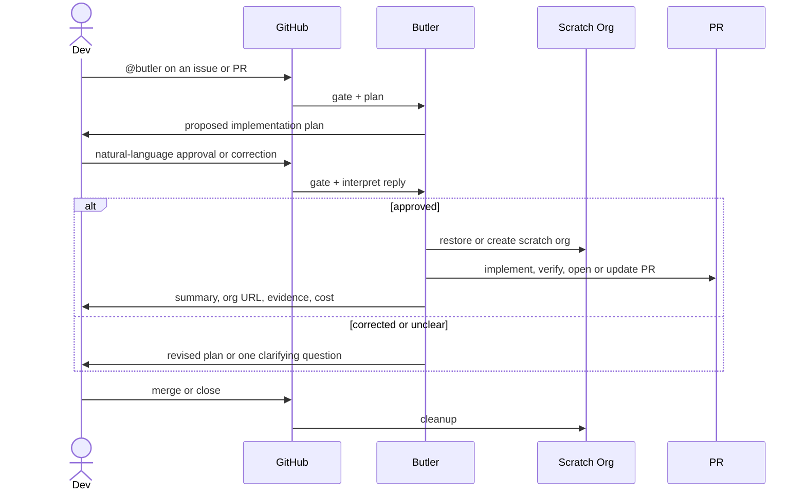

# salesforce-ai-tools [`v2026.5.6`](https://github.com/aquivalabs/salesforce-ai-tools/releases/tag/v2026.5.6)

Reusable GitHub Actions workflows and a versioned Claude Code plugin for AI-assisted Salesforce development. Drop these into any Salesforce repo to get an AI agent that triages issues, opens pull requests, verifies UI changes, and more — all triggered by a simple `@butler` mention.

## Contents

- [Claude Plugin](#claude-plugin)
  - [Skills](#skills)
  - [Install](#install)
- [GitHub Pipelines](#github-pipelines)
  - [Pipeline Flow](#pipeline-flow)
  - [Pipeline Steps](#pipeline-steps)
  - [Using in Your Repo](#using-in-your-repo)

---

## Claude Plugin

Claude Code loads the `salesforce-ai-tools` plugin locally and inside GitHub Actions. The plugin is versioned with this repository; release `v2026.5.1` contains plugin version `2026.5.1`.

The source of truth for skills is `plugins/salesforce-ai-tools/skills/`. Local
Claude or Codex folders such as `.claude/skills/` are install/runtime copies and
must not contain repo-owned skill source.

### Skills

| Skill | What it does |
| ----- | ------------ |
| **[sf-ticket-to-pr](plugins/salesforce-ai-tools/skills/sf-ticket-to-pr/SKILL.md)** | The core pipeline skill. Reads a GitHub issue or PR thread, proposes a concrete plan, waits for human approval, then codes, deploys to a scratch org, runs tests and PMD, captures Playwright UI evidence, opens a PR, and posts an auto-login org URL. It also keeps a small versioned Salesforce metadata failure memory so repeated deploy mistakes become searchable local knowledge. |
| **[agentforce](plugins/salesforce-ai-tools/skills/agentforce/SKILL.md)** | Tests and deploys Agentforce agents and prompt templates — multi-turn demo story, prompt template regression, Testing Center migration, and the manual fixups Salesforce CLI doesn't handle when iterating on Agentforce metadata. |
| **[agentforce-deploy](plugins/salesforce-ai-tools/skills/agentforce-deploy/SKILL.md)** | Encodes the manual fixups Salesforce CLI does not handle when deploying Agentforce metadata — schema.json scaffolding for genAiFunctions, prompt-template `versionIdentifier` bumps, schema-only-edit detection nudge, planner bundle topic refresh, and the deactivate/deploy/reactivate flow when an active agent blocks a deploy. |
| **[playwright-sf](plugins/salesforce-ai-tools/skills/playwright-sf/SKILL.md)** | Verifies Salesforce Lightning UI flows with Playwright CLI/scripts first, using MCP only for fallback selector discovery. Captures screenshots and frame-inspected video evidence for user-visible changes. |
| **[sf-code-analyzer](plugins/salesforce-ai-tools/skills/sf-code-analyzer/SKILL.md)** | Runs Salesforce Code Analyzer on changed Apex, Flow, or metadata files with smart rule selection. Detects managed packages and applies AppExchange security rules when relevant, otherwise runs opinionated clean-code rules. Invoked automatically by sf-ticket-to-pr after every code change. |
| **[markdown-web](plugins/salesforce-ai-tools/skills/markdown-web/SKILL.md)** | Fetches JS-rendered webpages via headless Chromium and returns clean markdown. Cracks shadow DOM and cookie-consent walls that defeat `WebFetch` — especially useful for help.salesforce.com and developer.salesforce.com docs. Per-domain rules live in `sites.json`. |

### Install

| Scope | Command | Use when |
| ----- | ------- | -------- |
| Personal | `scripts/install-sf-ai-tools.sh` | You want the plugin available in your own Claude Code setup. |
| Project | `scripts/install-sf-ai-tools.sh --scope project` | A repository should declare the plugin dependency for everyone working there. |
| CI/local checkout | `scripts/install-sf-ai-tools.sh --scope local --source .sf-ai-tools` | GitHub Actions has checked out this repo and should install that exact plugin copy. |

The installer is a compatibility wrapper around Claude Code plugin commands. It does not copy or symlink skills.

You can also install directly with Claude Code:

```bash
claude plugin marketplace add aquivalabs/salesforce-ai-tools
claude plugin install salesforce-ai-tools@aquiva-labs
```

Then reload plugins and invoke skills by their plugin-qualified names:

```text
/reload-plugins
/salesforce-ai-tools:sf-code-analyzer
/salesforce-ai-tools:agentforce-deploy
```

---

## GitHub Pipelines

The main pipeline is [sf-ticket-to-pr.yml](.github/workflows/sf-ticket-to-pr.yml). It listens for `@butler`, decides whether to act, provisions or restores a scratch org, makes the change, verifies it, and opens or updates a PR.

The cleanup pipeline is [sf-pr-cleanup.yml](.github/workflows/sf-pr-cleanup.yml). It only removes the scratch org and cached auth URL when the issue or PR is closed.

What the pipeline gives you:

- `@butler` works from issues, issue comments, PR reviews, and PR review comments.
- A cheap permission gate rejects bot events, missing mentions, and users without write-level access before Claude runs.
- Triage happens before Salesforce infrastructure, so clarifications and refusals do not create scratch orgs.
- The same scratch org is reused across the issue and follow-up PR comments.
- The PR contains the implementation summary, scratch-org login URL, deploy/test results, PMD findings, UI evidence when relevant, and cost footer.
- The same `salesforce-ai-tools` plugin is installed locally and in CI.
- Each phase runs a fit-for-purpose model: **Sonnet** for triage/planning, **Opus** for the long execute step, and **Sonnet** for failure-only metadata learning extraction.

### Pipeline Flow



### Pipeline Steps

#### Triage

The `triage` job in [sf-ticket-to-pr.yml](.github/workflows/sf-ticket-to-pr.yml) is the cheap decision point. It installs the plugin with [scripts/install-sf-ai-tools.sh](scripts/install-sf-ai-tools.sh), resolves whether the event belongs to an issue or PR, reads the full thread, and asks the `salesforce-ai-tools:sf-ticket-to-pr` skill to propose a plan, revise a pending plan, ask for clarification, split, refuse, or acknowledge that the latest human reply approved the current plan.

New work does not execute immediately. Butler posts a plan with a hidden pending marker and waits. A later human comment can approve or correct the plan in natural language; no approval labels or magic human keywords are required. Only after Butler interprets the latest human reply as clear approval does it write the hidden execute marker that starts the expensive job. This keeps architecture decisions human-reviewed before Salesforce CLI, Playwright, or scratch-org provisioning.

#### Execute

The `execute` job in [sf-ticket-to-pr.yml](.github/workflows/sf-ticket-to-pr.yml) runs only after a human-approved plan. It checks out the target branch, installs Salesforce CLI and Playwright, authenticates the DevHub, restores the cached scratch-org auth URL, and calls [scripts/create-scratch-org.sh](scripts/create-scratch-org.sh) to reuse or create the org.

The scratch org is keyed by issue number, not PR number. Follow-up runs on a PR reuse the same org when the PR body links back to the issue with `Closes #N`, `Fixes #N`, or `Resolves #N`.

Claude then implements the change, deploys the smallest relevant source paths, runs Apex tests, calls `sf-code-analyzer`, and captures Playwright evidence for visible UI changes. If a metadata deploy fails, `sf-ticket-to-pr` reads its local failure memory in [plugins/salesforce-ai-tools/skills/sf-ticket-to-pr/knowledge/](plugins/salesforce-ai-tools/skills/sf-ticket-to-pr/knowledge/) before trying another fix. New verified learnings can be written back there with an explicit review marker.

The job finishes by reporting cost with [.github/scripts/report-ai-cost.sh](.github/scripts/report-ai-cost.sh). The script appends a cost footer to Butler output and maintains the originating issue's cost rollup using hidden markers, so repeated edits do not double-count prior runs.

#### Cleanup

[sf-pr-cleanup.yml](.github/workflows/sf-pr-cleanup.yml) runs when the issue or PR closes, or when a human starts it manually with an issue number. It resolves the issue number, restores the scratch-org auth from cache, deletes the scratch org, and drops the cached auth URL. Cleanup is best-effort; if the org or cache entry is already gone, the workflow logs a notice and exits cleanly.

### Using in Your Repo

Prereqs: GitHub org admin, Salesforce DevHub, Anthropic API key.

#### Reference the Reusable Workflows

Create `.github/workflows/sf-ticket-to-pr.yml` in your repo:

```yaml
name: SF Ticket to PR

on:
  issues:
    types: [opened, edited]
  issue_comment:
    types: [created]
  pull_request_review:
    types: [submitted]
  pull_request_review_comment:
    types: [created]

jobs:
  pipeline:
    uses: aquivalabs/salesforce-ai-tools/.github/workflows/sf-ticket-to-pr.yml@main
    secrets: inherit
```

Create `.github/workflows/sf-pr-cleanup.yml`:

```yaml
name: SF PR Cleanup

on:
  pull_request:
    types: [closed]

jobs:
  cleanup:
    uses: aquivalabs/salesforce-ai-tools/.github/workflows/sf-pr-cleanup.yml@main
    secrets: inherit
```

The `on:` block stays in your repo. The `uses:` line delegates all logic here — this repo checks itself out at runtime, installs the Claude plugin, and runs the same skills used locally.

#### Set Repo Secrets

Settings → Secrets and variables → Actions:

| Secret | Value |
| ------ | ----- |
| `SFDX_AUTH_URL` | `sf org display --verbose --target-org <devhub> --json \| jq -r '.result.sfdxAuthUrl'` |
| `ANTHROPIC_API_KEY` | Your Anthropic API key. Or use `CLAUDE_CODE_OAUTH_TOKEN` to bill a Max subscription instead (`claude setup-token`). |

After the Salesforce CLI secret-redaction rollout on May 27, 2026, use `sf org auth show-sfdx-auth-url --target-org <devhub> --json | jq -r '.result.sfdxAuthUrl'` instead.

The built-in `GITHUB_TOKEN` covers everything else — no PAT or GitHub App needed.

#### Create the Label

```bash
gh label create ai-involved --description "Butler (AI) was involved in this issue or PR" --color FBCA04
```

#### Trigger It

Mention `@butler` in any issue or PR comment:

```
@butler please add a validation rule to Account that requires Phone when BillingCountry is "US"
```

Non-Salesforce repo? Replace the deploy/test commands in the `sf-ticket-to-pr` skill with your toolchain's equivalents. Different trigger word? Search-and-replace `@butler` in the workflow and the skill.
