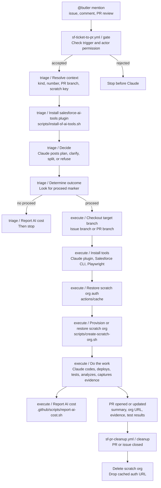

# salesforce-ai-tools [`v2026.5.0`](https://github.com/aquivalabs/salesforce-ai-tools/releases/tag/v2026.5.0)

Reusable GitHub Actions workflows and a versioned Claude Code plugin for AI-assisted Salesforce development. Drop these into any Salesforce repo to get an AI agent that triages issues, opens pull requests, verifies UI changes, and more — all triggered by a simple `@butler` mention.

## Contents

- [1. Claude plugin](#1-claude-plugin)
  - [1.1 Install locally](#11-install-locally)
  - [1.2 Install for a project](#12-install-for-a-project)
- [2. GitHub pipelines](#2-github-pipelines)
  - [2.1 Features](#21-features)
  - [2.2 Pipeline interaction](#22-pipeline-interaction)
  - [2.3 Stage breakdown](#23-stage-breakdown)
  - [2.4 Supporting files](#24-supporting-files)
  - [2.5 Metadata failure memory](#25-metadata-failure-memory)
  - [2.6 Using in your repo](#26-using-in-your-repo)

---

## 1. Claude plugin

Specialized behaviors Claude Code loads from the `salesforce-ai-tools` plugin. In CI the reusable workflow installs the plugin automatically — no setup needed. For local use, see [1.1 Install locally](#11-install-locally) below.

| Skill | What it does | Contributed by |
| ----- | ------------ | -------------- |
| **[sf-ticket-to-pr](plugins/salesforce-ai-tools/skills/sf-ticket-to-pr/SKILL.md)** | The core pipeline skill. Reads a GitHub issue or PR thread, decides whether to take it, clarify, split into sub-stories, or refuse — then codes, deploys to a scratch org, runs tests and PMD, captures Playwright UI evidence, opens a PR, and posts an auto-login org URL. It also keeps a small versioned Salesforce metadata failure memory so repeated deploy mistakes become searchable local knowledge. | [@rsoesemann](https://github.com/rsoesemann) |
| **[agentforce](plugins/salesforce-ai-tools/skills/agentforce/SKILL.md)** | Tests and deploys Agentforce agents and prompt templates — multi-turn demo story, prompt template regression, Testing Center migration, and the manual fixups Salesforce CLI doesn't handle when iterating on Agentforce metadata. | [@anmolgkv](https://github.com/anmolgkv) |
| **[agentforce-deploy](plugins/salesforce-ai-tools/skills/agentforce-deploy/SKILL.md)** | Encodes the manual fixups Salesforce CLI does not handle when deploying Agentforce metadata — schema.json scaffolding for genAiFunctions, prompt-template `versionIdentifier` bumps, schema-only-edit detection nudge, planner bundle topic refresh, and the deactivate/deploy/reactivate flow when an active agent blocks a deploy. | [@anmolgkv](https://github.com/anmolgkv) · [#12](https://github.com/aquivalabs/aquiva-skills/pull/12) |
| **[playwright-sf](plugins/salesforce-ai-tools/skills/playwright-sf/SKILL.md)** | Verifies Salesforce Lightning UI flows with Playwright CLI/scripts first, using MCP only for fallback selector discovery. Captures screenshots and frame-inspected video evidence for user-visible changes. | [@rsoesemann](https://github.com/rsoesemann) |
| **[sf-code-analyzer](plugins/salesforce-ai-tools/skills/sf-code-analyzer/SKILL.md)** | Runs Salesforce Code Analyzer on changed Apex, Flow, or metadata files with smart rule selection. Detects managed packages and applies AppExchange security rules when relevant, otherwise runs opinionated clean-code rules. Invoked automatically by sf-ticket-to-pr after every code change. | [@rsoesemann](https://github.com/rsoesemann) |
| **[markdown-web](plugins/salesforce-ai-tools/skills/markdown-web/SKILL.md)** | Fetches JS-rendered webpages via headless Chromium and returns clean markdown. Cracks shadow DOM and cookie-consent walls that defeat `WebFetch` — especially useful for help.salesforce.com and developer.salesforce.com docs. Per-domain rules live in `sites.json`. | [@aidan-harding](https://github.com/aidan-harding) · [#4](https://github.com/aquivalabs/aquiva-skills/pull/4) |

### 1.1 Install locally

Add the Aquiva Labs marketplace and install the plugin:

```bash
claude plugin marketplace add aquivalabs/salesforce-ai-tools
claude plugin install salesforce-ai-tools@aquiva-labs
```

Existing automation can use the compatibility installer; it uses the same Claude plugin commands and does not copy or symlink skills:

```bash
scripts/install-sf-ai-tools.sh
```

Then reload plugins and invoke skills by their plugin-qualified names:

```text
/reload-plugins
/salesforce-ai-tools:sf-code-analyzer
/salesforce-ai-tools:agentforce-deploy
```

Plugin versions match GitHub releases. Release `v2026.5.0` contains plugin version `2026.5.0`.

### 1.2 Install for a project

For repos that should always use these tools, install the marketplace and plugin at project scope:

```bash
scripts/install-sf-ai-tools.sh --scope project
```

That records the plugin dependency in the project instead of asking every contributor to clone this repo or run a symlink installer.

---

## 2. GitHub pipelines

Reusable GitHub Actions workflows that drive the `@butler` agent end-to-end: gate, triage, scratch-org execution, evidence, PR, cost reporting, and cleanup.

### 2.1 Features

| | |
| - | - |
| **Permission-gated trigger** | `gate` rejects bot events, missing `@butler` mentions, and users without `write`, `maintain`, or `admin` permission before Claude runs. |
| **Triage before infra** | `triage` is Claude-only. Clarifications, splits, and refusals do not provision a scratch org. |
| **Persistent scratch org** | `execute` restores the same per-issue scratch org from cache, so follow-up runs continue in the same org. |
| **Thread-native workflow** | Butler reads the issue or PR thread every time; no labels or external state machine decide what to do. |
| **Self-evidencing PRs** | PRs include scratch-org access, deploy/test results, PMD findings, and Playwright UI evidence when the change is visible. |
| **Cost transparency** | `report-ai-cost.sh` appends per-run cost and updates the originating issue with a sticky rollup. |
| **Plugin-based skills** | Both local use and GitHub Actions install the same `salesforce-ai-tools` Claude plugin. |
| **No GitHub App needed** | Commits and PRs use the built-in `GITHUB_TOKEN` as `github-actions[bot]`. |

### 2.2 Pipeline interaction



The diagram labels are intentionally close to workflow job and step names. The reusable entry points are [sf-ticket-to-pr.yml](.github/workflows/sf-ticket-to-pr.yml) for the main run and [sf-pr-cleanup.yml](.github/workflows/sf-pr-cleanup.yml) for cleanup.

### 2.3 Stage breakdown

#### 2.3.1 Gate

`sf-ticket-to-pr.yml` starts with the `gate` job. Its single step, `Check trigger and actor permission`, is a cheap shell check before Claude is invoked.

| Property | Value |
| - | - |
| File | [.github/workflows/sf-ticket-to-pr.yml](.github/workflows/sf-ticket-to-pr.yml) |
| Job | `gate` |
| Main step | `Check trigger and actor permission` |
| Inputs | GitHub event payload, triggering actor, triggering text |
| Output | `proceed=true` or `proceed=false` |

The gate accepts only real `@butler` mentions from users with `write`, `maintain`, or `admin` repository permission. Bot-authored events and comments without `@butler` stop here.

#### 2.3.2 Triage

`triage` runs only when `gate.outputs.proceed == 'true'`. It installs the Claude plugin, resolves the issue/PR context, asks Claude to decide whether the request is actionable, and writes the decision back to GitHub.

| Property | Value |
| - | - |
| File | [.github/workflows/sf-ticket-to-pr.yml](.github/workflows/sf-ticket-to-pr.yml) |
| Job | `triage` |
| Key steps | `Checkout salesforce-ai-tools`, `Install salesforce-ai-tools plugin`, `Resolve context`, `Decide`, `Determine outcome`, `Report AI cost` |
| Plugin install | [scripts/install-sf-ai-tools.sh](scripts/install-sf-ai-tools.sh) |
| Skill | `salesforce-ai-tools:sf-ticket-to-pr` |
| Outputs | `proceed`, `kind`, `number`, `pr_branch`, `scratch_key`, `plan` |

Claude chooses one of four outcomes: take it, clarify, split, or refuse. Only a take-it decision includes the hidden `<!-- butler:proceed -->` marker. `Determine outcome` scans the latest bot comment for that marker; without it, the pipeline stops after cost reporting.

#### 2.3.3 Execute

`execute` runs only after triage sets `proceed=true`. It checks out the target branch, prepares the Salesforce and browser tooling, restores or provisions the scratch org, then lets Claude perform the implementation and verification.

| Property | Value |
| - | - |
| File | [.github/workflows/sf-ticket-to-pr.yml](.github/workflows/sf-ticket-to-pr.yml) |
| Job | `execute` |
| Key steps | `Configure git`, `Create branch for new issue`, `Install Salesforce CLI`, `Install Playwright Chromium`, `Authenticate DevHub`, `Restore scratch org auth from cache`, `Provision or restore scratch org`, `Do the work`, `Report AI cost` |
| Scratch-org script | [scripts/create-scratch-org.sh](scripts/create-scratch-org.sh) |
| Cache key | `scratch-auth-pr-<issue-number>` |
| Concurrency group | `scratch-org-<issue-number>` |
| Claude mode | `--permission-mode bypassPermissions` |

The scratch key is issue-based, including PR follow-ups when the PR body links back with `Closes #N`, `Fixes #N`, or `Resolves #N`. That keeps one scratch org alive across the issue run and every follow-up on the PR. Claude deploys the smallest relevant paths, runs Apex/metadata checks, calls `sf-code-analyzer`, and uses Playwright evidence for visible UI changes.

#### 2.3.4 PR output

The implementation run opens or updates a PR through the `sf-ticket-to-pr` skill. Every PR should carry enough evidence for review without digging through Actions logs.

Expected PR contents:

- Summary of what changed and why
- Scratch-org auto-login URL
- Deploy and Apex test results
- PMD / Salesforce Code Analyzer results
- Inline screenshots for visible UI changes
- Frame-inspected video link when an interactive flow needs video evidence
- Cost footer from `report-ai-cost.sh`

#### 2.3.5 Cost reporting

Both Claude jobs call [.github/scripts/report-ai-cost.sh](.github/scripts/report-ai-cost.sh). The script reads the Claude execution file, appends a cost footer to the latest Butler comment or PR, and upserts a sticky cost rollup on the originating issue.

Cost rows are stored with hidden `<!-- butler:cost:... -->` markers so repeated edits do not double-count prior runs.

#### 2.3.6 Cleanup

Cleanup is a separate reusable workflow, [sf-pr-cleanup.yml](.github/workflows/sf-pr-cleanup.yml). It runs when a PR closes, an issue closes/deletes, or a human invokes `workflow_dispatch` with an issue number.

| Property | Value |
| - | - |
| File | [.github/workflows/sf-pr-cleanup.yml](.github/workflows/sf-pr-cleanup.yml) |
| Job | `cleanup` |
| Key steps | `Resolve issue number`, `Install Salesforce CLI`, `Authenticate DevHub`, `Restore scratch org auth from cache`, `Delete scratch org`, `Drop cached auth URL` |
| Cache key | `scratch-auth-pr-<issue-number>` |

The cleanup job is best-effort. If the org or cache entry is already gone, it logs a notice and exits cleanly.

### 2.4 Supporting files

| File | Role |
| - | - |
| [.github/workflows/sf-ticket-to-pr.yml](.github/workflows/sf-ticket-to-pr.yml) | Main reusable workflow: gate, triage, execute. |
| [.github/workflows/sf-pr-cleanup.yml](.github/workflows/sf-pr-cleanup.yml) | Cleanup workflow for scratch orgs and cached auth URLs. |
| [scripts/install-sf-ai-tools.sh](scripts/install-sf-ai-tools.sh) | Installs the `salesforce-ai-tools` Claude plugin through the Aquiva Labs marketplace. |
| [scripts/create-scratch-org.sh](scripts/create-scratch-org.sh) | Provisions or restores the per-issue scratch org. |
| [.github/scripts/report-ai-cost.sh](.github/scripts/report-ai-cost.sh) | Adds per-run cost footers and maintains the issue-level cost rollup. |
| [plugins/salesforce-ai-tools/skills/sf-ticket-to-pr/SKILL.md](plugins/salesforce-ai-tools/skills/sf-ticket-to-pr/SKILL.md) | Claude runbook for triage, implementation, verification, and PR behavior. |
| [plugins/salesforce-ai-tools/skills/sf-ticket-to-pr/knowledge/](plugins/salesforce-ai-tools/skills/sf-ticket-to-pr/knowledge/) | Metadata failure memory used during deploy troubleshooting. |

### 2.5 Metadata failure memory

`sf-ticket-to-pr` carries a small Karpathy-style local wiki under [plugins/salesforce-ai-tools/skills/sf-ticket-to-pr/knowledge/](plugins/salesforce-ai-tools/skills/sf-ticket-to-pr/knowledge/), inspired by Andrej Karpathy's [LLM Wiki gist](https://gist.github.com/karpathy/442a6bf555914893e9891c11519de94f). It is not general documentation. It is retrieval-oriented pipeline memory for Salesforce metadata failures.

When a metadata deploy fails, Butler must stop editing, classify the failing metadata type, read the routed knowledge file, apply one targeted fix, and redeploy the smallest relevant source path. If local knowledge is missing, it prefers live scratch-org retrieval, then official Salesforce docs, public GitHub examples for metadata shape, and Salesforce StackExchange only for error interpretation.

Validated new learnings are written back as compact symptom-to-fix entries. Agents may only mark entries as `AI-observed, not human-reviewed`; humans can later change trust to `Human-reviewed`, `Superseded`, or `Rejected`. To audit the wiki, search for `AI-observed, not human-reviewed` and review the linked source run or retrieve command.

### 2.6 Using in your repo

Prereqs: GitHub org admin, Salesforce DevHub, Anthropic API key.

#### 2.6.1 Reference the reusable workflows

Create `.github/workflows/sf-ticket-to-pr.yml` in your repo:

```yaml
name: SF Ticket to PR

on:
  issues:
    types: [opened, edited]
  issue_comment:
    types: [created]
  pull_request_review:
    types: [submitted]
  pull_request_review_comment:
    types: [created]

jobs:
  pipeline:
    uses: aquivalabs/salesforce-ai-tools/.github/workflows/sf-ticket-to-pr.yml@main
    secrets: inherit
```

Create `.github/workflows/sf-pr-cleanup.yml`:

```yaml
name: SF PR Cleanup

on:
  pull_request:
    types: [closed]

jobs:
  cleanup:
    uses: aquivalabs/salesforce-ai-tools/.github/workflows/sf-pr-cleanup.yml@main
    secrets: inherit
```

The `on:` block stays in your repo. The `uses:` line delegates all logic here — this repo checks itself out at runtime, installs the Claude plugin, and runs the same skills used locally.

#### 2.6.2 Set repo secrets

Settings → Secrets and variables → Actions:

| Secret | Value |
| ------ | ----- |
| `SFDX_AUTH_URL` | `sf org display --verbose --target-org <devhub> --json \| jq -r '.result.sfdxAuthUrl'` |
| `ANTHROPIC_API_KEY` | Your Anthropic API key. Or use `CLAUDE_CODE_OAUTH_TOKEN` to bill a Max subscription instead (`claude setup-token`). |

After the Salesforce CLI secret-redaction rollout on May 27, 2026, use `sf org auth show-sfdx-auth-url --target-org <devhub> --json | jq -r '.result.sfdxAuthUrl'` instead.

The built-in `GITHUB_TOKEN` covers everything else — no PAT or GitHub App needed.

#### 2.6.3 Create the label

```bash
gh label create ai-involved --description "Butler (AI) was involved in this issue or PR" --color FBCA04
```

#### 2.6.4 Trigger it

Mention `@butler` in any issue or PR comment:

```
@butler please add a validation rule to Account that requires Phone when BillingCountry is "US"
```

Non-Salesforce repo? Replace the deploy/test commands in the `sf-ticket-to-pr` skill with your toolchain's equivalents. Different trigger word? Search-and-replace `@butler` in the workflow and the skill.
